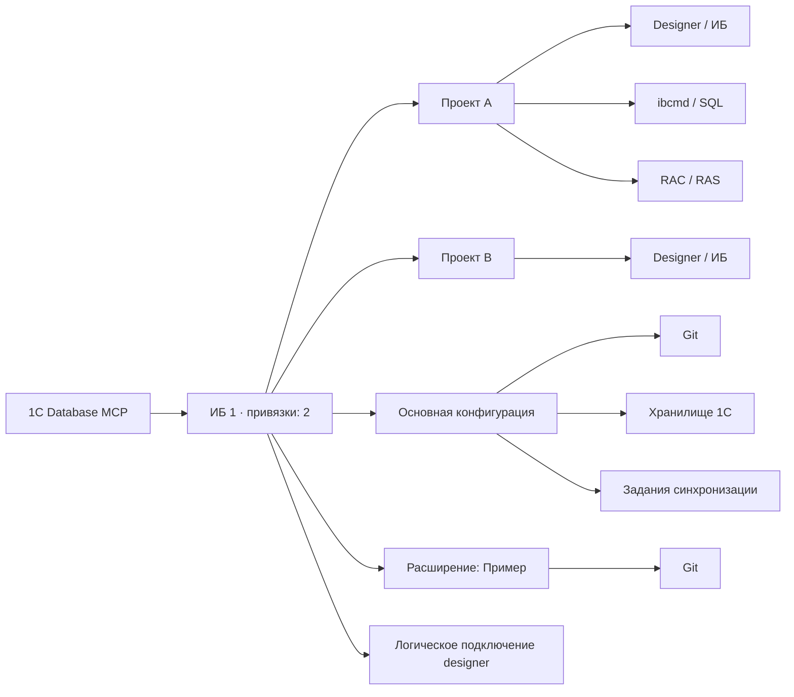

# Структура подключений 1C Database MCP

Учебный пример ниже показывает одну физическую ИБ с двумя проектными привязками. Это не снимок настроенных БД.

Один экземпляр ИБ объединяет проектные привязки и разделяет очередь операций. Каждый компонент (основная конфигурация или расширение) имеет собственные настройки Git/хранилища и задания синхронизации. Логическое подключение (lease) не означает работающий Designer; удерживаемый и автоматический lease могут сосуществовать, их типы показаны вместе. Число активных операций показано отдельно.

Фактическую карту текущего владельца возвращает read-only MCP инструмент `database_topology_get`: структурированные `databases` и `mermaid`. Он читает локальную память и настройки, не запускает 1С и не включает адреса, пути или секреты. `SettingsValid` означает локальную проверку формата и путей, а `ComponentInventoryChecked` — успешную read-only инвентаризацию компонентов; ни одно из этих полей не доказывает доступность ИБ прямо сейчас. Не сохраняйте runtime-снимок в публичный репозиторий.
