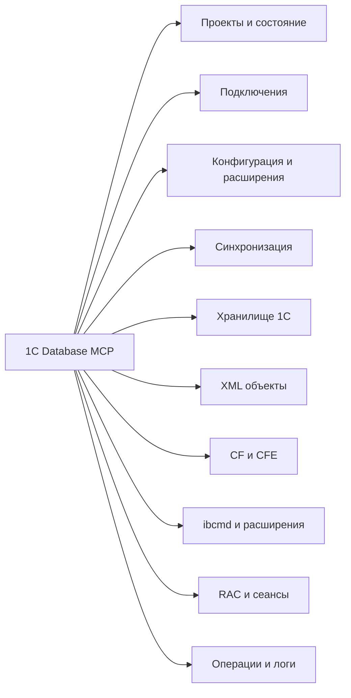

# Возможности 1C Database MCP

Карта создана из типизированных категорий настоящего реестра `tools/list`. Она описывает функции сервиса, а не стадии выполнения команд.

- [Все опубликованные MCP инструменты по группам](tool-catalog.md)
- [Как устроены подключённые БД и где взять фактическую карту](database-topology.md)
- [Технические схемы исполнения](load-workflows.md)
