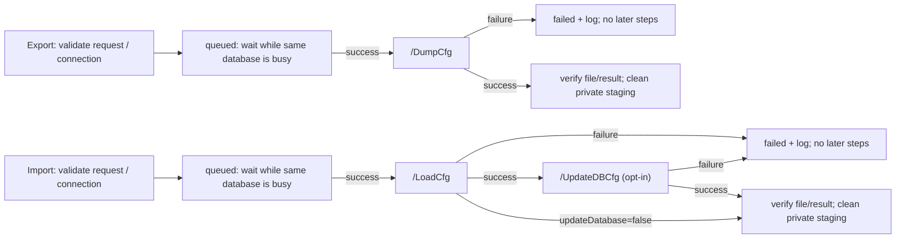
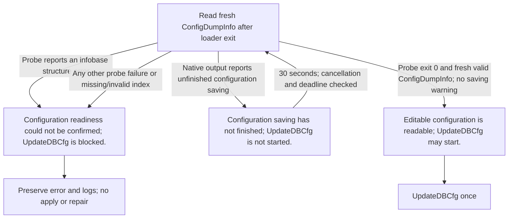
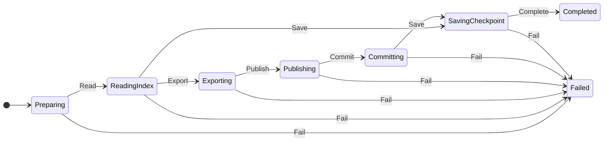
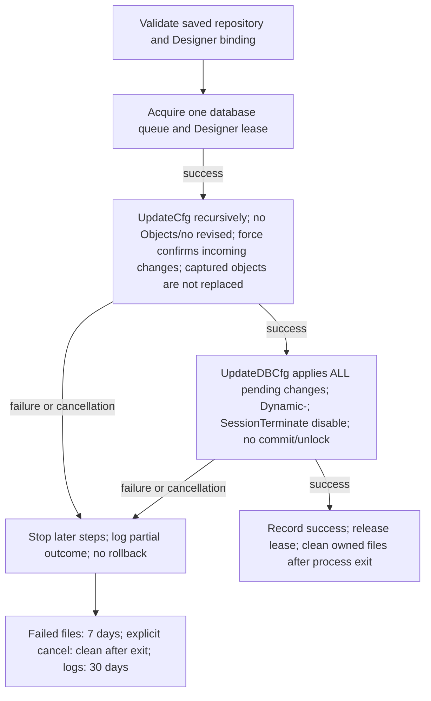
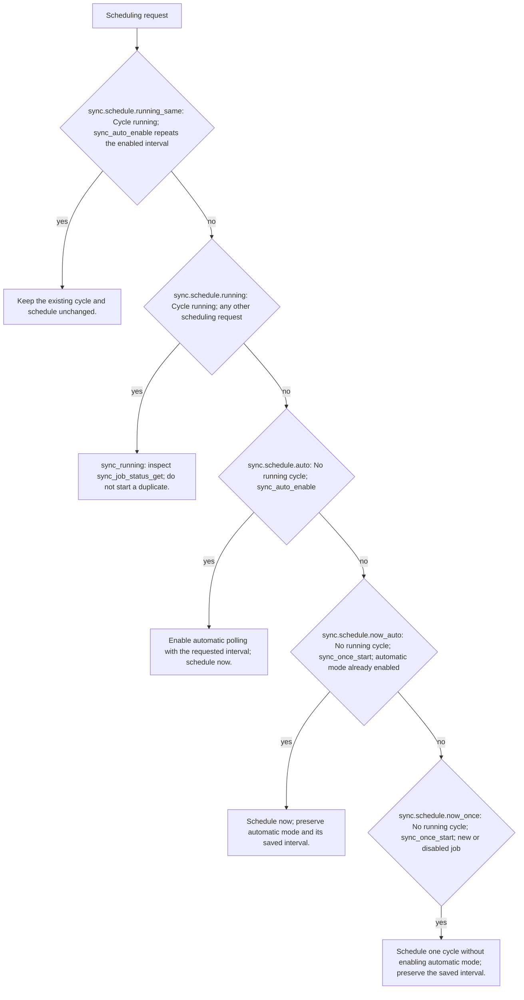
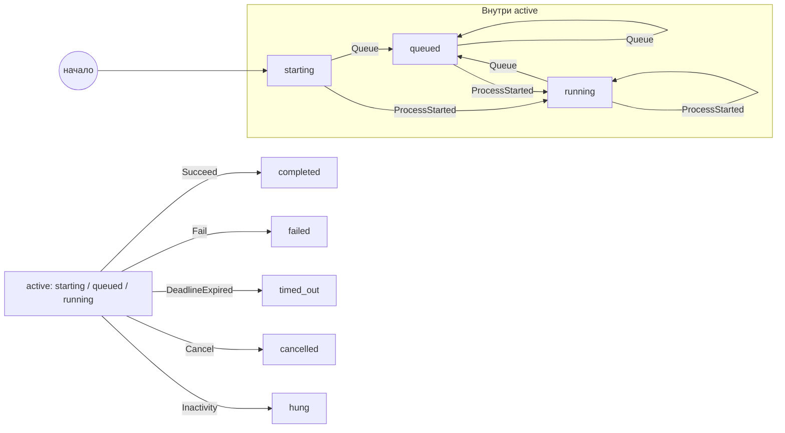
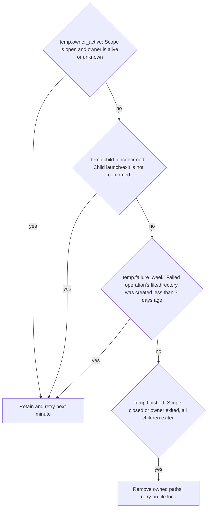

# Loading workflows (generated from executable models)

Generation: `.agents/build.ps1 -Configuration Debug|Release`; freshness: `.agents/export-workflows.ps1 -Check`. No machine paths/credentials are included. Native Designer compatibility is not proven by simulated tests.

- [binary-configuration-rules.md](binary-configuration-rules.md)
- [database-topology.md](database-topology.md)
- [designer-export.md](designer-export.md)
- [designer-import.md](designer-import.md)
- [designer-path-rules.md](designer-path-rules.md)
- [designer-readiness.md](designer-readiness.md)
- [designer-repository-rules.md](designer-repository-rules.md)
- [features.md](features.md)
- [git-export-rules.md](git-export-rules.md)
- [ibcmd-workspaces.md](ibcmd-workspaces.md)
- [log-retention.md](log-retention.md)
- [sync-rules.md](sync-rules.md)
- [sync-scheduling.md](sync-scheduling.md)
- [temporary-files.md](temporary-files.md)
- [tool-catalog.md](tool-catalog.md)

## designer-import.mmd

```mermaid
stateDiagram-v2
	direction LR
	Preparing --> Acquired : Acquire
	Preparing --> Failed : Fail
	Acquired --> RootCaptured : CaptureRoot
	Acquired --> IndexRead : ReadIndex
	Acquired --> Failed : Fail
	RootCaptured --> IndexRead : ReadIndex
	RootCaptured --> Failed : Fail
	IndexRead --> ManifestRead : ReadManifest
	IndexRead --> Validated : Validate
	IndexRead --> Failed : Fail
	ManifestRead --> Validated : Validate
	ManifestRead --> Failed : Fail
	Validated --> ObjectsCaptured : CaptureObjects
	Validated --> PackagePrepared : PreparePackage
	Validated --> Failed : Fail
	ObjectsCaptured --> PackagePrepared : PreparePackage
	ObjectsCaptured --> Failed : Fail
	PackagePrepared --> Rechecked : Recheck
	PackagePrepared --> Failed : Fail
	Rechecked --> Loaded : Load
	Rechecked --> Failed : Fail
	Loaded --> Verified : Verify
	Loaded --> Failed : Fail
	Verified --> Applied : Apply
	Verified --> Committed : Commit
	Verified --> Completed : Complete
	Verified --> Failed : Fail
	Applied --> Committed : Commit
	Applied --> Completed : Complete
	Applied --> Failed : Fail
	Committed --> Completed : Complete
	Committed --> Failed : Fail
[*] --> Preparing
state "Preparing: Validate saved binding and input identities; reject caller Configuration and ambiguous paths" as Preparing
state "Acquired: Wait for and acquire the database operation lease; own private workspace" as Acquired
state "RootCaptured: Add + automatic repository: capture Configuration NONRECURSIVELY; no forced capture" as RootCaptured
state "IndexRead: Dump ConfigDumpInfo only; read format, root names, UUIDs and versions" as IndexRead
state "ManifestRead: Add only: root-version delta export; require only Configuration.xml and optional index; no full fallback" as ManifestRead
state "Validated: Update: existing names and UUIDs; add: new names and unique UUIDs; validate XML version" as Validated
state "ObjectsCaptured: Update + automatic repository: capture selected existing roots recursively" as ObjectsCaptured
state "PackagePrepared: Verify source hashes; copy only input files; add only: append names to matching groups in Configuration.xml" as PackagePrepared
state "Rechecked: Fresh index: refuse changed identity, root set or selected metadata; no Configuration/CF export" as Rechecked
state "Loaded: Log exact list, sizes and SHA-256; LoadConfigFromFiles listFile + partial; later error is NOT rollback" as Loaded
state "Verified: Fresh post-load index: verify expected root set, UUIDs and unchanged Configuration external properties before apply/commit" as Verified
state "Applied: Optional UpdateDBCfg: all pending changes; Dynamic-; session policy and warningsAsErrors" as Applied
state "Committed: capture_and_commit only: selected roots recursively; add includes Configuration nonrecursively" as Committed
state "Completed: Confirm child exit; clean owned files; keep downloadable logs for 30 days; preserve caller files" as Completed
state "Failed: Record exact error/partial outcome; stop owned process if needed; no rollback/unlock; retain failed files 7 days" as Failed
```

## binary-configuration.mmd

## designer-readiness.mmd

## git-sync.mmd

```mermaid
stateDiagram-v2
	direction LR
	fetching --> no_changes : Unchanged
	fetching --> waiting_git_retry : AccessUnavailable
	fetching --> waiting_new_commit : RejectedCommit
	fetching --> reserving : UpdateRequired
	fetching --> failed : Fail
	reserving --> importing : Reserved
	reserving --> waiting_database : Busy
	reserving --> failed : Fail
	importing --> checking_updates : Imported
	importing --> failed : Fail
	checking_updates --> importing : NewerCommit
	checking_updates --> applying : CaughtUp
	checking_updates --> failed : Fail
	applying --> completed : Applied
	applying --> failed : Fail
[*] --> fetching
state "fetching: Lock checkout; fetch saved remote/branch with saved SSH; compare last success; validate clean linear source; NO DB lease" as fetching
state "no_changes: No new loadable files: acknowledge version without inventory, Designer or ibcmd" as no_changes
state "waiting_new_commit: Rejected hash unchanged: retain original failure; wait for a newer commit without DB calls" as waiting_new_commit
state "waiting_git_retry: Git/SSH unavailable: retain error; automatic retry after one hour; no DB lease" as waiting_git_retry
state "reserving: Changed files only: resolve component inventory; reserve saved adapter and database queue" as reserving
state "importing: Immutable commit snapshot; validate files; ibcmd config import full source or changed files with partial; tracked PID and private working data" as importing
state "checking_updates: Fetch again AFTER import and BEFORE apply; a newer commit is imported under the same lease" as checking_updates
state "applying: No newer commit: ibcmd config apply force, then config check; preserve last success until BOTH finish" as applying
state "completed: Persist successful commit/history; release lease/checkout; clean owned snapshots after process exit" as completed
state "waiting_database: Database busy: defer to next interval; do not interrupt its owner" as waiting_database
state "failed: Stop later steps; if import began and not cancelled, attempt editable config reset; recovery rules decide retry; failed files 7 days, logs 30 days" as failed
```

## git-export.mmd

## repository-sync.mmd

## sync-scheduling.mmd

## database-operation-overview.mmd

## temporary-files.mmd

