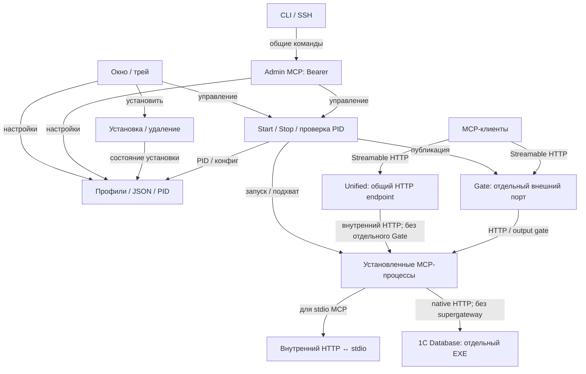
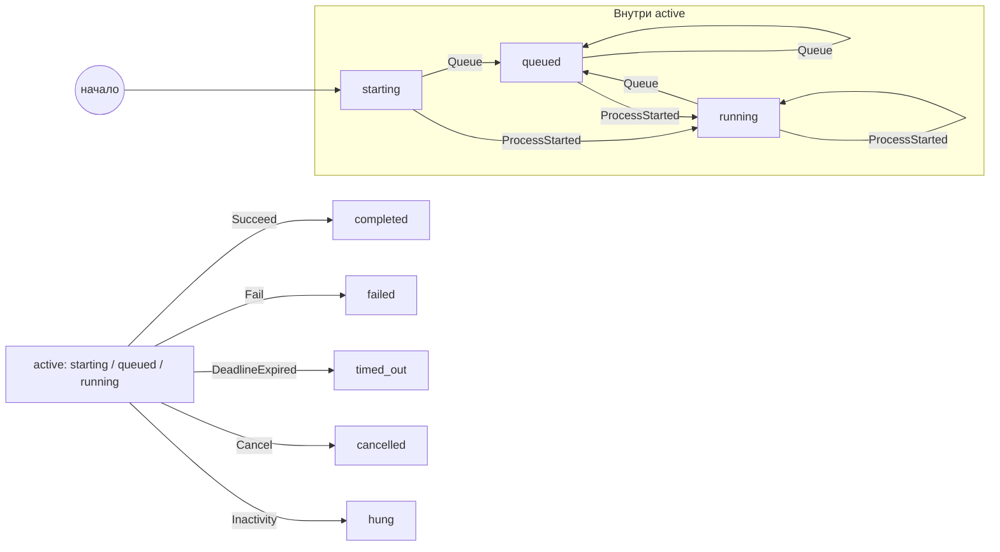
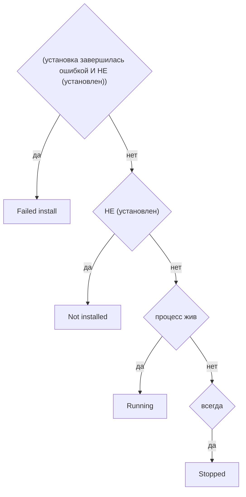

# Текущие правила MCP Control Center

Сгенерировано из исполняемых C# моделей. Не редактировать вручную.

Общая схема — навигационная карта компонентов CC. Детальные схемы и таблицы генерируются из исполняемых правил статуса, действий, портов и операций отдельного 1C Database. Это не полный граф классов: health, установка и группы хранилища не представлены как полностью моделируемые процессы.

## Общая схема CC

Подробнее: [локальный просмотрщик со всеми схемами](index.html), [статус и действия](#базовый-статус-mcp), [порты](publication.mmd), [операция 1С](database-operation-overview.mmd), [CF/CFE](binary-configuration.mmd), [правила импорта](binary-configuration-rules.md).

## Операция 1C Database

Источник: `OneCDatabaseOperationLifecycle`, вызывается из `OneCDatabaseOperation`.

События: Queue — очередь; ProcessStarted — запуск очередного процесса; Succeed/Fail — завершение; DeadlineExpired — явно заданный предел времени; Cancel — отмена; Inactivity — подтверждённый простой. Конечный результат не перезаписывается поздними событиями. Исходный экспорт Stateless: [stateDiagram](database-operation.mmd).

## Базовый статус MCP

Источник: `McpWorkflowRules.Statuses` → `McpActionPolicy.StatusLabel`. Первое совпадение; Installing/Command — отдельные UI-подписи, здесь не моделируются. Running не означает успешный health.

## Доступность действий

Источник: `McpWorkflowRules.Actions` → `McpActionPolicy` → меню и пакетные действия MainForm. Это UI-доступность, не полная проверка безопасности запуска. Истина — доступно; ложь — недоступно.

| ID | Действие | Условие доступности |
| --- | --- | --- |
|MCP01|Start|((установлен И НЕ (процесс жив)) И есть команда запуска)|
|MCP02|Stop|процесс жив|
|MCP03|Install|((НЕ (установлен) И НЕ (установка завершилась ошибкой)) И есть источник установки)|
|MCP04|Reinstall|(((установлен ИЛИ установка завершилась ошибкой) И НЕ (процесс жив)) И есть источник установки)|
|MCP05|RemoveFiles|(((установлен ИЛИ установка завершилась ошибкой) И НЕ (процесс жив)) И есть источник установки)|
|MCP06|Edit|всегда|
|MCP07|Delete|НЕ (процесс жив)|
|MCP08|UserCommand|(установлен И (НЕ (процесс жив) ИЛИ команда разрешена при работающем MCP))|
|MCP09|BatchStart|(((Active включён И установлен) И НЕ (процесс жив)) И есть команда запуска)|
|MCP10|BatchStop|процесс жив|
|MCP11|BatchRestart|((Active включён И установлен) И есть команда запуска)|

## Optional HTTP publication ports

Source: `McpEndpointRules`, used by runtime, UI and admin. Applies independently to Unified port and each External port; Internal port must always be openable.

| ID | Range | State | Listener |
| --- | --- | --- | --- |
|port.off|0..0|Disabled|Closed|
|port.reserved|1..1023|Reserved: closed (red)|Closed|
|port.open|1024..65535|Enabled|Open|

Out-of-range values are invalid. Port 0 persists across configuration updates. Unified uses the internal endpoint directly; disabling publication never changes the MCP process status.

Проверка фактов (процесс, файлы, источник установки) остаётся кодом вызывающей стороны. Диаграмма не доказывает правильность этих фактов. Независимые проверки: `.test/smoke-workflow-rules.ps1` и процессные тесты 1C Database.
